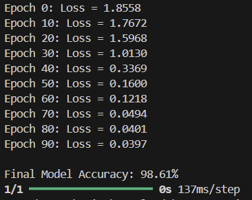
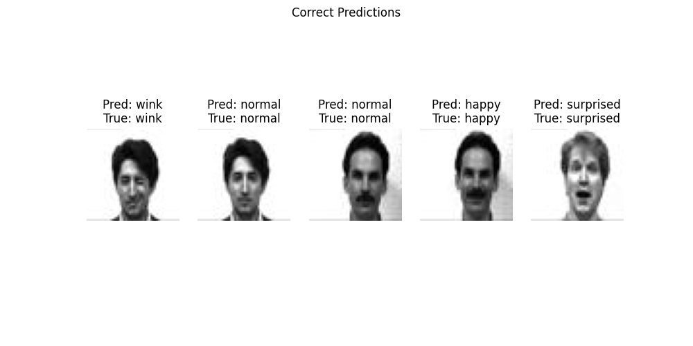
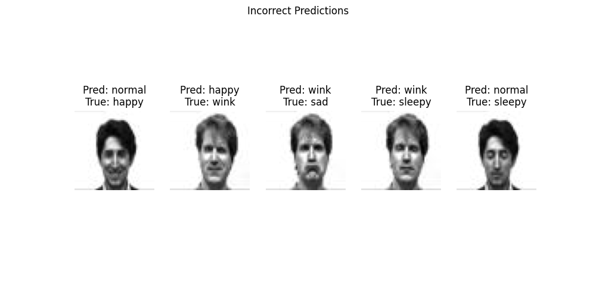
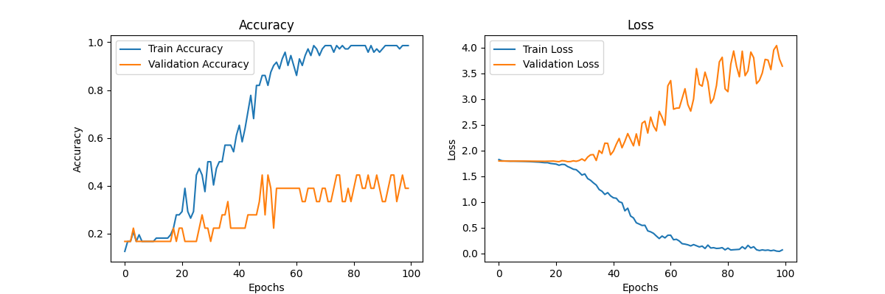
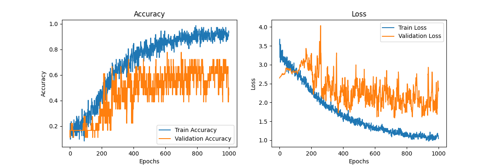
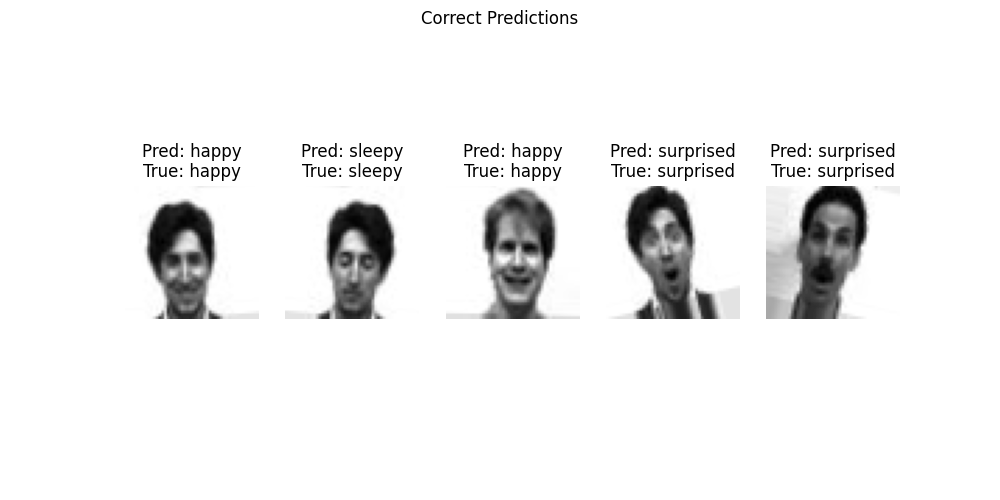
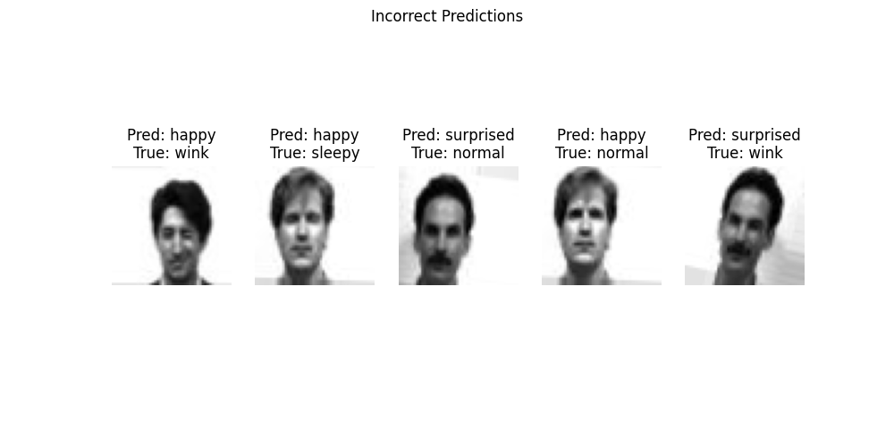
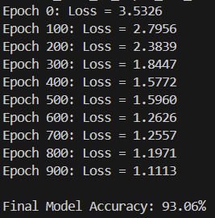
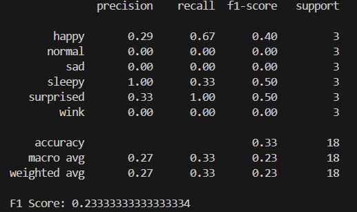

# Facial Expression Recognition (FER) model

After successfully training the model, here are the test results:

## Overall performance: 

## Sample of correctly predicted results

## Sample of incorrectly predicted results

## Validation loss and training loss curve of the original model 

## Validation loss and training loss of the updated model 

## Correct predictions of the updated model

## incorrect predictions of the updated model

## Output of the updated model 

# Changes to the model 

- Data changes: 
    - Took out the images concering lighting and glasses entirely as they were distracting the model
- Data augmentation: 
    - As we can see from some of the sample images, the data has been augmented ( by flipping, cropping, etc.)
    - Augmenting the data 
- Overall model approach 
    - If we take a look at the loss curves for the original model, we can see that it was really good in identifying trained data, but it was only getting worse in identifying new data (as it was overfitting)
    - It went from essentially one block to multiple blocks, added a lot more layers and regularization, etc.

# Suggested tweaks to the model 

- Change the structure of the model 
    - less/more layers
    - removing/adding more regularixation
- Change parameters
    - Reduce/increase learning rate 
    - add/remove epochss
- Check if the measurements are wrong
    - console log raw data and test 
    - other debugging techniques to make sure that we are measuring the model correctly 

Note that these are only some suggestions, you guys can try something completely different too. 

# How to run this Repo

- Clone the repo
    - Type in "git clone https://github.com/saioku/facial-expression-recognition.git" in your terminal 
- Make sure that all of the dependencies are satisfied 
    - ex: if your python environment doesnt recognize the "PIL" import, type in "pip install pillow" or "conda install pillow" based on what your environment is. 
- After all the dependencies are satisfied, run "python main.py"

Note that I used an IDE (VS code) to develop this model if you want to do the same. 

