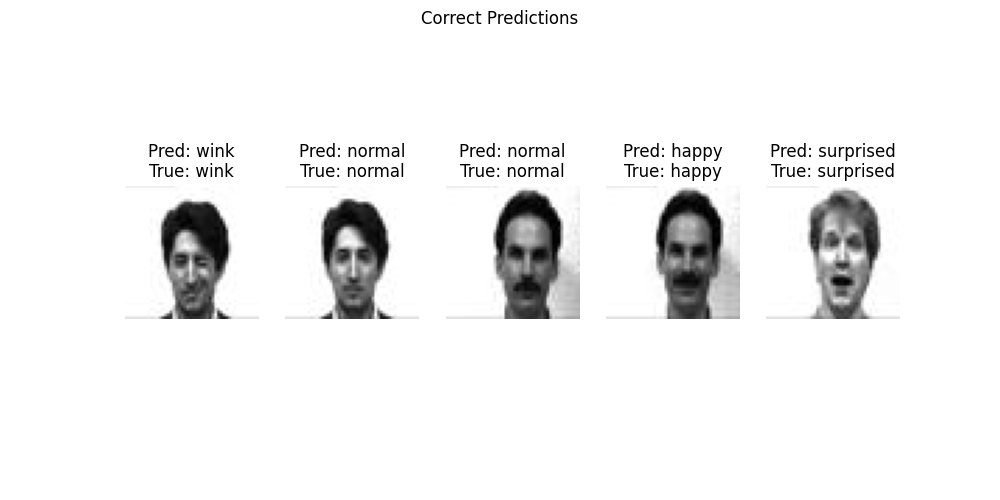

# Facial Expression Recognition (FER) model

After successfully training the model, here are the test results:

## Overall performance: 

## Sample of correctly predicted results

## Sample of incorrectly predicted results

